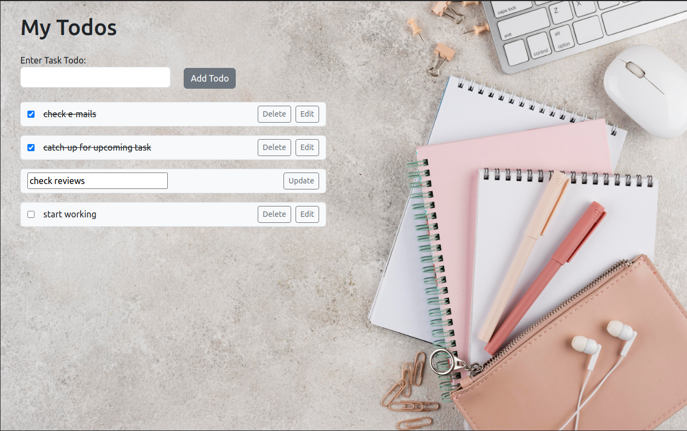

# TODO APP using Typescript

Simple to-do app can be incredibly helpful in organizing tasks, here you can create, edit and delete the todo list.



```
export interface ITodo {
  id: Number;
  text: string;
  isDone: boolean;
  isEdit: boolean;
}
```

## line-through todo

```
function handleCheck(e: React.ChangeEvent<HTMLInputElement>, id: Number) {
    if (e.target.checked) {
      handleStrike(id, "done");
    } else {
      handleStrike(id, "undone");
    }
  }

\\ App.tsx
function handleStrike(id: Number, type: string) {
    const newTodos = [...todos];
    const idx = newTodos.findIndex((nt) => nt.id === id);
    if (idx !== -1) {
      if (type === "done") newTodos[idx]["isDone"] = true;
      else newTodos[idx]["isDone"] = false;
    }
    setTodos(newTodos);
  }
```
